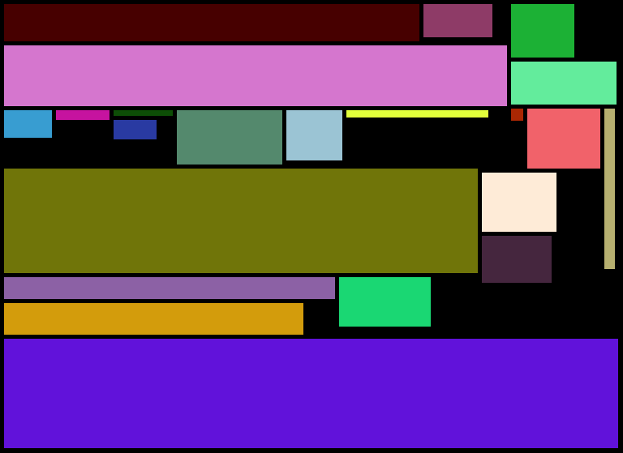

rect-packer [![Build Status]][Travis CI]
========
Pack multiple rectangles into a larger one. Can be used for packing sprites into a
texture for 2d games. Uses skyline heuristic. Heavily tested with random data to ensure
that it always produces correct result.

[Documentation](https://docs.rs/rect_packer/)

[Crates.io package](https://crates.io/crates/rect_packer)

--------

[MIT License](LICENSE)

[Build Status]: https://travis-ci.org/kryptan/rect_packer.svg?branch=master
[Travis CI]: https://travis-ci.org/kryptan/rect_packer
